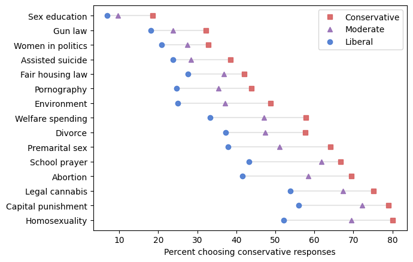

# Political Alignment Case Study

Using data from the General Social Survey, this case study explore changing opinions on a variety of topics among survey respondents in the United States. One of about 120 survey questions is chosen and  responses are analyzed - how they have changed over time and how these changes relate to political alignment (conservative, moderate, or liberal). This project is part of [the *Elements of Data Science* curriculum](https://allendowney.github.io/ElementsOfDataScience/), by [Allen B. Downey](https://www.allendowney.com/wp/).

## The notebooks
1. **Cleaning and validation**: The first notebook loads data from the General Social Survey (GSS) and walks through the process of cleaning and validating the data. At the end, you can help me by choosing a random variable, checking the values against the codebook, and reporting your results.

2. **Exploration**: This notebook uses the tools of exploratory data analysis to look at survey responses about political alignment. It uses PMFs to display distributions, time series to represent changes over time, and cross tabulation to look at changes in distribution over time. It also introduces local regression as a way to plot a smooth line through noisy data.

3. **Political alignment and outlook**: This notebook explores the relationship between political alignment and three survey questions related to “outlook”. It uses a pivot table to compute the mean of the response variable grouped by political alignment and time.

4. **Political alignment and other beliefs**: This notebook explores the relationship between political alignment and other attitudes and beliefs. It is a template for a do-it-yourself, choose-your-own-adventure mini-project, where you have the chance to explore a variable in the GSS dataset and report the results.

Copyright 2020 Allen B. Downey

License: [Attribution-NonCommercial-ShareAlike 4.0 International (CC BY-NC-SA 4.0)](https://creativecommons.org/licenses/by-nc-sa/4.0/)
